# DiffusionCreamPy

*Decensoring Hentai with Modern AI Models.*

Inspired by deeppomf's [DeepCreamPy](https://github.com/Deepshift/DeepCreamPy/): A guide to censorship removal in Hentai artwork using inpainting techniques with modern generative AI models.

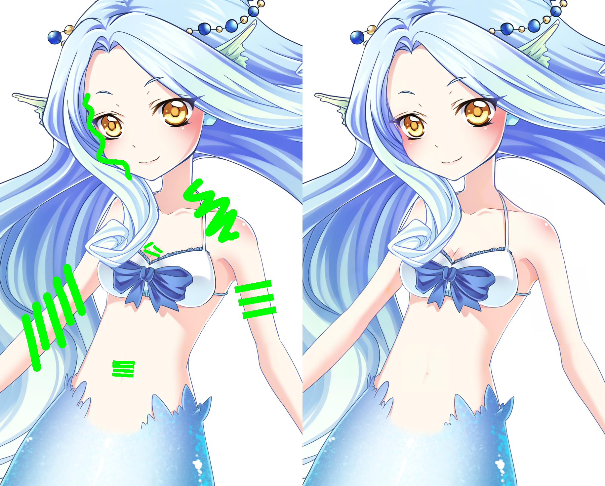

Currently, DiffusionCreamPy offers 3 ComfyUI workflow templates for different purposes:

- [DiffusionCreamPy-Bar-CNet++](workflows/DiffusionCreamPy-Bar-CNet++.json) workflow removes bar censorship from a preprocessed image.

- [DiffusionCreamPy-Mosaic-CNet++](workflows/DiffusionCreamPy-Mosaic-CNet++.json) workflow removes mosaic censorship from an image.

- [DiffusionCreamPy-Inpaint-CNet++](workflows/DiffusionCreamPy-Inpaint-CNet++.json) workflow enables you to refine the decensored image or locally repaint specific details.

See the [Usage](#usage) section for more instructions.

## Features & Comparisons

|                       | DiffusionCreamPy | DeepCreamPy |
|-----------------------|------------------|-------------|
| Bar Removal           | ★★★★★         | ★★★☆☆     |
| Mosaic Removal        | ★★★☆☆         | ★☆☆☆☆     |
| Models                | Replaceable      | Built-in    |
| Variations            | Infinity         | Up to 4     |
| Tweaking              | Yes              | No          |
| Organ Limitations     | No               | Yes         |
| Image Size            | Any              | Any         |
| Batch Processing      | No               | Yes         |

Here is a detailed comparison of sample images generated by Animagine XL 4.0 Opt.  
*(no prompt, seed=1, mask_expand=2, mask_blur=4, mask_padding=56)*

| Mask                       | DiffusionCreamPy                | DeepCreamPy                |
|----------------------------|---------------------------------|----------------------------|
| 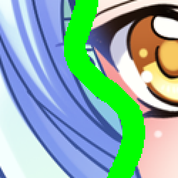 | 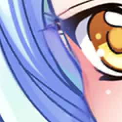 | 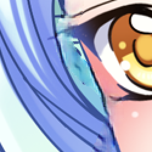 |
|  | 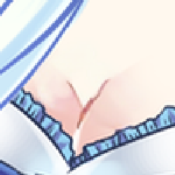 | 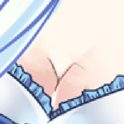 |
| 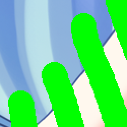 | 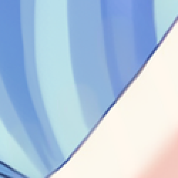 | 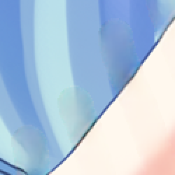 |
|  | 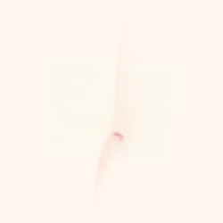 | 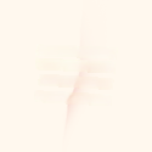 |

Mosaic in different cell sizes:

| Mosaic                     | DiffusionCreamPy                | DeepCreamPy                |
|----------------------------|---------------------------------|----------------------------|
|  | 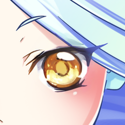 |  |
| 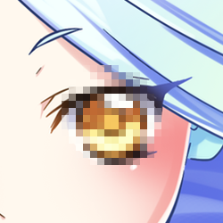 | 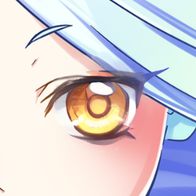 |  |
|  | 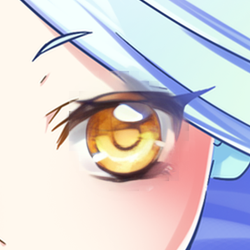 |  |

## System Requirements

- GPU: 12GB VRAM for a good experience; 16GB+ VRAM for high performance.
- RAM: 32GB is recommended for stability; 16GB is the bare minimum.

Compared to the models built into DeepCreamPy, Stable Diffusion XL is an absolute hardware hog.
Even though ComfyUI allows you to run the models on a CPU, I wouldn't recommend that anyone wait several dozen minutes for an uncertain result.

## Installation

### ComfyUI

Before we could start, you need to first complete the installation of a working [ComfyUI setup](https://github.com/Comfy-Org/ComfyUI?tab=readme-ov-file#windows-portable). This tutorial is demonstrated with ComfyUI version `0.16.3`; I believe any newer version should also work.

> The custom nodes and models mentioned below should prompt you to install them when importing workflows; you only need to download and install them manually if you encounter issues.

### Custom Nodes

You will also need the following ComfyUI custom nodes for the workflows to function correctly:

- [comfyui-advanced-controlnet](https://github.com/Kosinkadink/ComfyUI-Advanced-ControlNet)
- [comfyui_controlnet_aux](https://github.com/Fannovel16/comfyui_controlnet_aux)
- [comfyui-inpaint-nodes](https://github.com/Acly/comfyui-inpaint-nodes)
- [comfyui-inpainteasy](https://github.com/CY-CHENYUE/ComfyUI-InpaintEasy)

> Please refer to the installation instructions for the respective projects.

### Stable Diffusion XL Models

The following models have been tested and perform the task well; I think the differences between them are merely stylistic. If you can't decide, go with Animage XL 4.0 Opt.

- Animagine XL 4.0 Opt ([Civitai](https://civitai.com/models/1188071/animagine-xl-40) | [Hugging Face](https://huggingface.co/cagliostrolab/animagine-xl-4.0))
- Anything XL Beta4 ([Civitai](https://civitai.com/models/9409/or-anything-xl) | [Hugging Face](https://huggingface.co/genai-archive/anything-xl))
- Illustrious XL v2.0 ([Civitai](https://civitai.com/models/1369089/illustrious-xl-20) | [Hugging Face](https://huggingface.co/OnomaAIResearch/Illustrious-XL-v2.0))

Any model fine-tuned on Stable Diffusion XL 1.0 should be capable of handling our task. If you wish to decensor realistic images, simply switch to a photorealistic model.

> Downloaded *.safetensors files should be placed in `ComfyUI/models/checkpoints`

### ControlNet Models

- ControlNet Union Promax for SDXL ([Hugging Face](https://huggingface.co/xinsir/controlnet-union-sdxl-1.0))

> Downloaded `diffusion_pytorch_model_promax.safetensors` should be renamed to `controlnet-union-sdxl-1.0.safetensors` and placed in `ComfyUI/models/controlnet`

## Usage

These ComfyUI workflows offer similar user interfaces:

- A [Load Image](https://comfyui-wiki.com/en/comfyui-nodes/image/load-image) node for image uploading.
- A `CustomCreamPy` node for tweaking.
- A [Preview Image](https://comfyui-wiki.com/en/comfyui-nodes/image/preview-image) node to display the cropped/inpainted image.
- A [Save Image](https://comfyui-wiki.com/en/comfyui-nodes/image/save-image) node to output the final merged image.

### Bar Censorship Removal

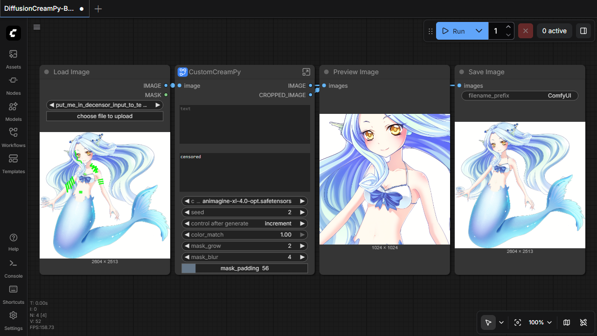

This is a template for bar removal, delivering the best results with the highest fidelity.

1. Download workflow [DiffusionCreamPy-Bar-CNet++.json](workflows/DiffusionCreamPy-Bar-CNet++.json).
2. [Import the workflow](https://comfyui-wiki.com/en/interface/workflow#importing-workflows) in ComfyUI.
3. [Fill obscured areas](https://github.com/Deepshift/DeepCreamPy/blob/master/docs/TROUBLESHOOTING_DECENSORS.md) in the image with green (`#00FF00`).
4. Upload the preprocessed image via `Load Image` node.
5. Click the `Run` (or `Queue`) button in the upper right corner.

The process pipeline is exactly identical to DeepCreamPy:
  > The user must color censored regions in their Hentai green with an image editing program (e.g. GIMP, Photoshop). DeepCreamPy takes the green colored images as input, and a neural network automatically fills in the censored regions.

By using external tools to meticulously fill in the obscured areas, you can preserve the details of the original image to the greatest extent possible.

### Mosaic Censorship Removal

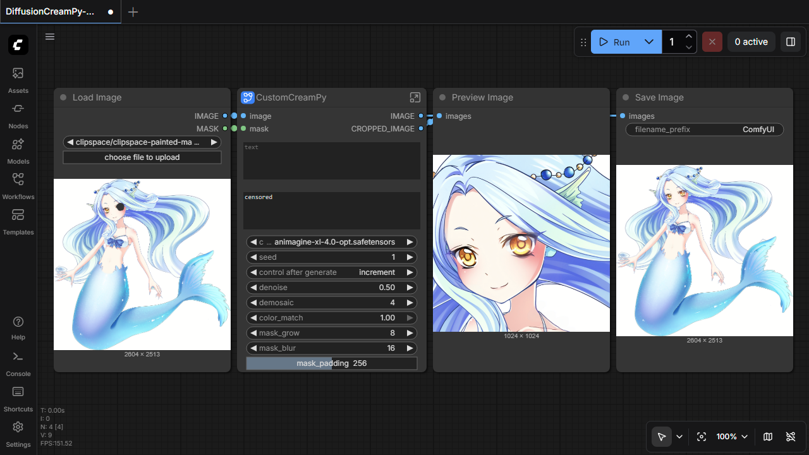

This is a template for mosaic removal.

1. Download workflow [DiffusionCreamPy-Mosaic-CNet++.json](workflows/DiffusionCreamPy-Bar-CNet++.json).
2. [Import the workflow](https://comfyui-wiki.com/en/interface/workflow#importing-workflows) in ComfyUI.
3. Upload an image via `Load Image` node.
4. Right-click the `Load Image` node and select `Open in MaskEditor` from the menu.
5. In the `Mask Editor`, click on the image to fill the area obscured by mosaic.
6. Click the `Run` (or `Queue`) button in the upper right corner.

Unlike DeepCreamPy, you don't even need to edit the original image; just roughly fill in the mosaic areas using the built-in [Mask Editor](https://docs.comfy.org/interface/maskeditor).

### Basic Inpainting

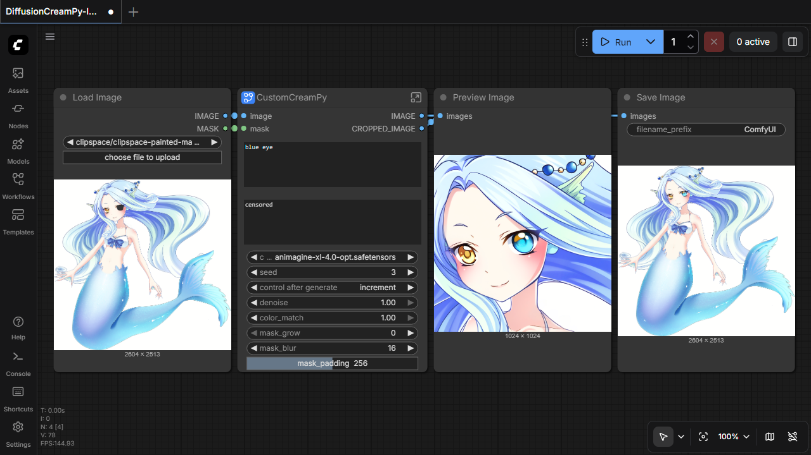

This is the most basic and original use of the inpainting techniques.

1. Download workflow [DiffusionCreamPy-Inpaint-CNet++.json](workflows/DiffusionCreamPy-Inpaint-CNet++.json).
2. [Import the workflow](https://comfyui-wiki.com/en/interface/workflow#importing-workflows) in ComfyUI.
3. Upload an image via `Load Image` node or [copy & paste](https://docs.comfy.org/tutorials/basic/inpaint#using-the-mask-editor) from previous output.
4. Right-click the `Load Image` node and select `Open in MaskEditor` from the menu.
5. In the `Mask Editor`, click on the image to fill the area you want to modify.  
   5.1. (Optional) Roughly modify the original image on the Paint Layer.
6. Enter [prompts](#prompts) in the text boxes according to your intention.
7. Click the `Run` (or `Queue`) button in the upper right corner.

You can use this workflow to refine the outputs or locally adjust the details, or even roughly remove bar censorship without preprocessing the images.

## Tweaking

### Prompts

The first text box accepts the `positive prompt`, a description of what you **want** to appear in the image.

The second text box accepts the `positive prompt`, a description of what you **don’t want** in the image.

You can use short sentences or combinations of [Booru Tags](https://safebooru.donmai.us/wiki_pages/tag_groups) as prompts.

In most cases, you can leave them empty. Generally, the model can "guess" the occluded parts on its own, unless the following situations apply:

- The occluded area is too large.
- More refined image adjustments.
- Significantly alter the content of the image.

### Models

The `ckpt_name` dropdown is used to specify the model name.
You must first [download a Stable Diffusion XL model](#stable-diffusion-xl-models) and place it in the correct directory before you can select it.

### Seeding

The `seed` parameter holds a random number generator's starting point. Identical seeds with identical other parameters will produce the same image every time. This is essential for reproducible results.

The `control_after_generate` parameter controls what happens to the `seed` after it generates an image.
Set it to 'fixed' if you want to keep the current seed.

### Preprocessing

The `denoise` parameter determines how much noise is added to an image before the sampling steps.

- For mosaic removal,  *0.5~1.0* is a meaningful range.
- For basic inpainting, *0.1~1.0* is a meaningful range.

A lower value ​​means a closer resemblance to the original image, while a higher value generates more creative images according to your prompts. In particular, if you always end up with blurry images in the mosaic removal workflow, you can also try increasing the value of `denoise`.

| denoise = 0.4 | 0.6 | 0.8 | 1.0 |
|---------------|-----|-----|-----|
| 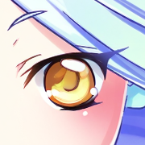 | 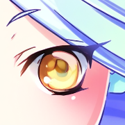 | 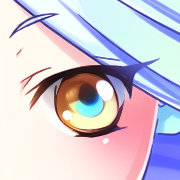 | 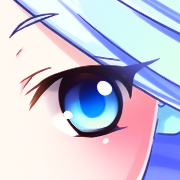 |

The `demosaic` parameter controls the intensity of the blurring applied to the original image before the sampling steps. 

Depending on the mosaic intensity, *3~5* is a suitable range. Lower values ​​mean more detail is preserved in the original image, but values ​​that are too low will cause the demosaicing process to fail.

| demosaic = 2  | 3 | 4 | 5 |
|---------------|---|---|---|
| 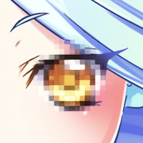 | 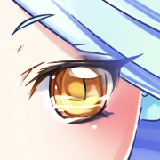 | 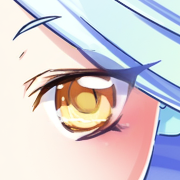 | 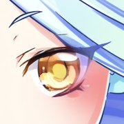 |

### Masking

The `mask_grow` parameter expands the mask by a certain amount of pixels when merging the inpainted area with the original image.

Sometimes you might encounter situations where you can't eliminate color banding or the inpainted content doesn't match the original image well. In these cases, you can try setting `mask_grow` to a larger value, causing the discrete mask regions to merge into a single continuous block.

| mask_grow  | 0 | 2 | 16 |
|------------|---|---|----|
| Mask       |  |  | 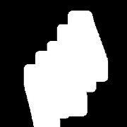 |
| Merged     | 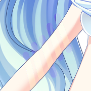 |  | 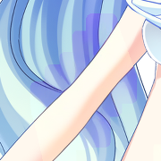 |

The `mask_blur` parameter determines the number of pixels used for blending the inpainted area with the original image. A higher value can create a smoother transition but may also affect the inpainted region.

Typically, when `mask_blur` is increased, `mask_grow` should also be increased proportionally to maintain the relationship: `mask_blur = mask_grow * 2`.

| mask_blur  | 0 | 8 | 32 |
|------------|---|---|----|
| Mask   |  |  |  |
| Merged |  |  | 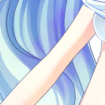 |

The `mask_padding` parameter determines how many pixels will be added around the edges of the mask, thereby defining the final area to be repainted.

It is important to choose an appropriate inpainting context area: if the context is too broad, it may degrade the details within the mask region, while if it is too narrow (or too tight), the model may lack sufficient context to understand the surrounding image content.

### Postprocessing

The `color_match` parameter controls the strength of color correction.

Generally, the color correction step can automatically match the colors of the generated image to the original image. If you encounter issues with color banding or incorrect color matching, you can try lowering the value of `color_match`.

## Conclusion

Here are some inpainting approaches I've tried:

- Stable Diffusion IMG2IMG
- Stable Diffusion Inpaint Model
- Stable Diffusion + ControlNet
- Qwen Image Edit
- Stable Diffusion XL + Fooocus Inpaint
- Stable Diffusion XL + ControlNet
- Stable Diffusion XL + ControlNetPlus (You Are Here)

They each have their own advantages and limitations; some work like magic but lack the means to refine the details, while others do not work at all and produce weird results.

So far, SDXL with CNet++ is the best combination I've experienced.

If you have any better solutions or suggestions, please let me know :P

## Acknowledgements

Example mermaid image by Shurajo & AVALANCHE Game Studio under [CC BY 3.0 License](https://creativecommons.org/licenses/by/3.0/). The example image is modified from the original, which can be found [here](https://opengameart.org/content/mermaid).
